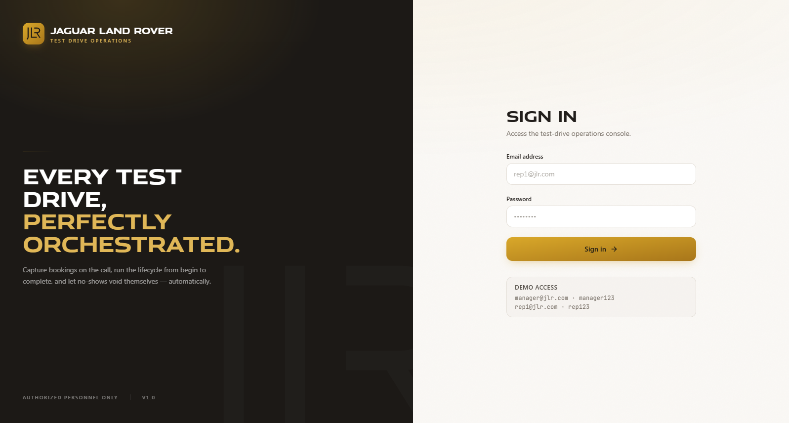
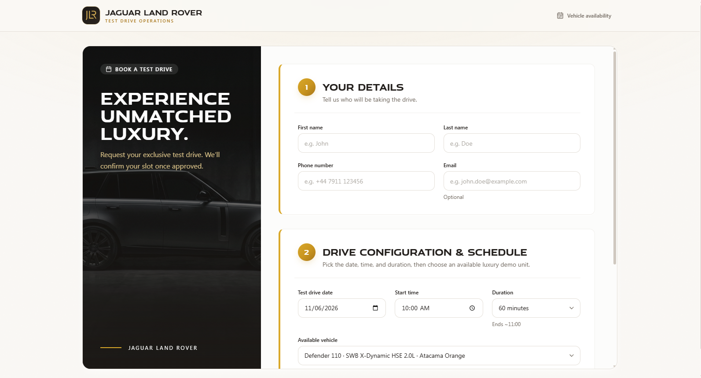
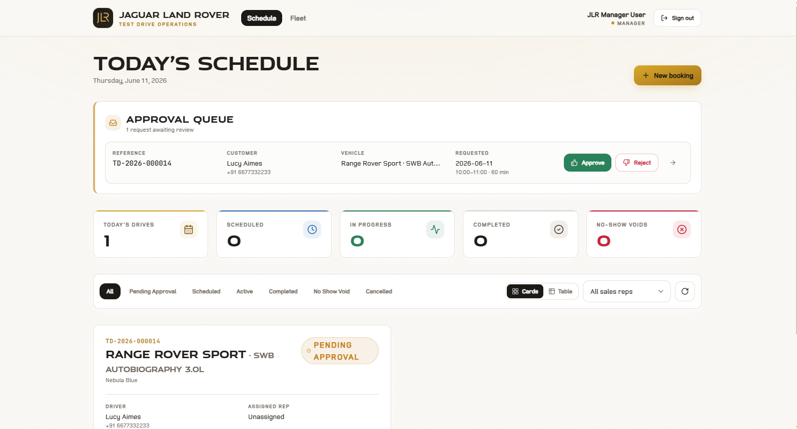
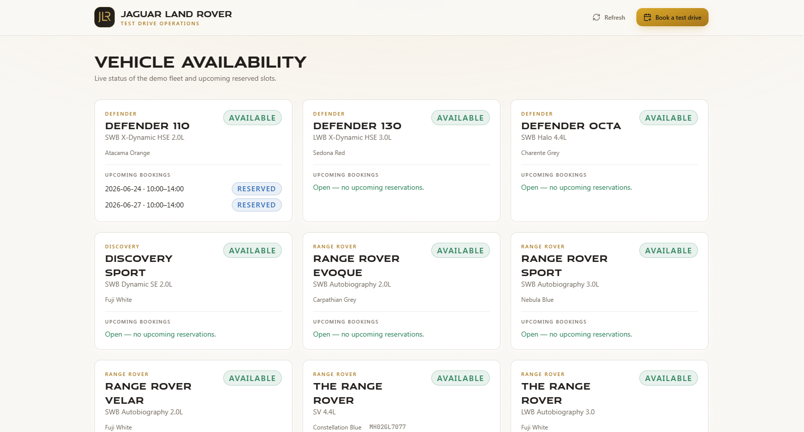
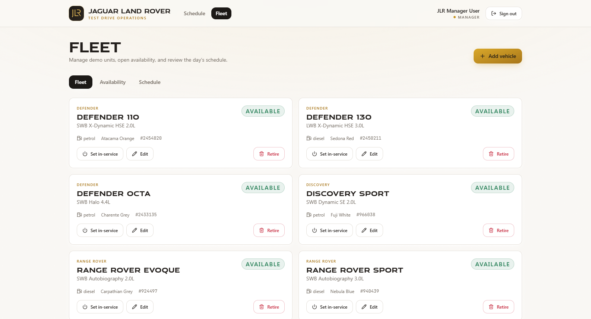
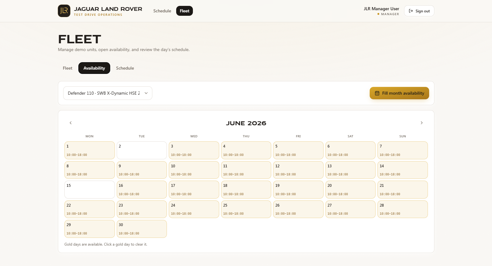
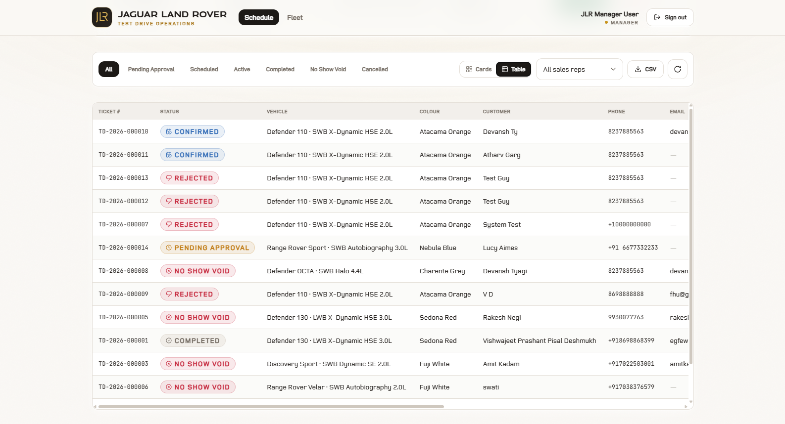
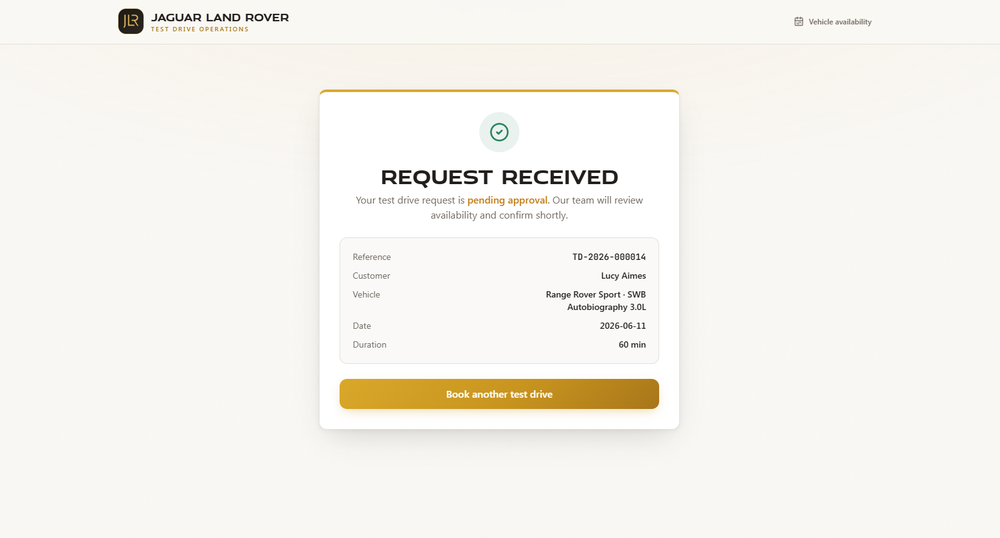

# JLR Test Drive Booking Automation

### Every test drive, perfectly orchestrated.

**The all-in-one platform that turns test-drive chaos into a calm, controlled, revenue-protecting workflow — from the first customer request to the keys in their hand.**

*Built for premium automotive retail. Designed to never let a demo vehicle, a lead, or a minute go to waste.*

[**Request a Live Demo →**](mailto:navnitamrutharaj1234@gmail.com?subject=JLR%20Test%20Drive%20Platform%20—%20Demo%20Request)&nbsp;&nbsp;|&nbsp;&nbsp;[**Get In Touch →**](mailto:navnitamrutharaj1234@gmail.com?subject=JLR%20Test%20Drive%20Platform%20—%20Enquiry)

---

---

## Why Dealerships Lose Money on Test Drives

A test drive is the single most powerful step in selling a luxury vehicle — and most showrooms still run it on paper, spreadsheets, and memory. The result is predictable:

- **No-shows** silently lock up a £60k–£150k demo car for hours while paying customers wait.
- **Double-bookings** turn an exciting appointment into an apology.
- **Lost leads** slip through the cracks because nobody owns the follow-up.
- **Zero visibility** — managers can't see what's booked, what's running, or what went wrong.

Every one of those is a sale that didn't happen. **This platform closes the gap.**

---

## The Platform

A beautifully simple, end-to-end system that runs the entire test-drive journey — and quietly protects your fleet and your revenue while it does it.

> **Customers request. Managers approve. Drives run themselves. No-shows clean themselves up.**

---

## What It Does

| Capability | What It Means For You |
|------------|------------------------|
| **Effortless Booking** | Customers (or your team) request a drive in seconds — the system only ever offers vehicles that are genuinely free, so a double-booking simply can't happen. |
| **Manager Approval Queue** | Every request lands in one clean queue. Approve, assign a rep, set the duration, or decline — in a single click. |
| **Live Fleet Availability** | See every vehicle's status at a glance — free, reserved, or out on a drive — with upcoming slots laid out in front of you. |
| **Self-Healing No-Shows** | If a customer doesn't turn up, the booking voids itself after a grace period and instantly frees the car for the next sale. No chasing, no cleanup. |
| **Availability Planning** | Open and fill a whole month of availability per vehicle from a visual calendar — plan your fleet weeks ahead. |
| **Live Operations Dashboard** | A real-time command center: today's drives, what's scheduled, what's active, what's completed, and every no-show — all on one screen. |
| **One-Click Reporting** | Export every booking to a clean spreadsheet for reporting, auditing, and follow-up. |
| **Smart Alerts** | The team is nudged before drives start and before slots expire — so nothing is ever forgotten. |
| **Role-Based Access** | Tailored views for sales reps, managers, and administrators — everyone sees exactly what they need, nothing they don't. |
| **Showroom-Grade Design** | A premium, branded experience that feels as considered as the vehicles it sells. |

---

## See It In Action

### A Manager's Command Center
Approve incoming requests, track every live drive, and read the day at a glance.

### Your Whole Fleet, Under Control
Know exactly which vehicles are available and which are spoken for — instantly.

### Plan Availability a Month Ahead
A clean visual calendar to open up exactly when each vehicle can be driven.

### Every Booking, Beautifully Organized
A powerful, sortable ledger of every drive — searchable, filterable, exportable.

### A Confirmation Customers Trust
Polished, reassuring, on-brand — from the very first interaction.

---

## The Outcome

When the whole journey runs on one platform, the numbers move:

- **Demo vehicles stop sitting idle** — freed automatically the moment a no-show happens.
- **No more double-bookings** — availability is enforced, not hoped for.
- **Every lead is captured and owned** — nothing slips through.
- **Managers finally have visibility** — the entire operation on a single screen.
- **The brand experience stays premium** — from the first click to the keys.

> *Less admin. Fewer missed sales. A test-drive operation that runs like the cars it sells.*

---

## Interested?

This platform is **available by request**. If you run a dealership, a showroom group, or an automotive retail operation and want to see it live — or discuss tailoring it to your brand — let's talk.

### [**Request a Demo →**](mailto:navnitamrutharaj1234@gmail.com?subject=JLR%20Test%20Drive%20Platform%20—%20Demo%20Request)

**navnitamrutharaj1234@gmail.com**

*Get in touch and I'll walk you through it personally.*

---

© 2026 Navnit Amrutharaj. All Rights Reserved.

*This repository showcases the product. It does not contain the source code.*
*Access, licensing, and deployment are available by arrangement — [get in touch](mailto:navnitamrutharaj1234@gmail.com).*

